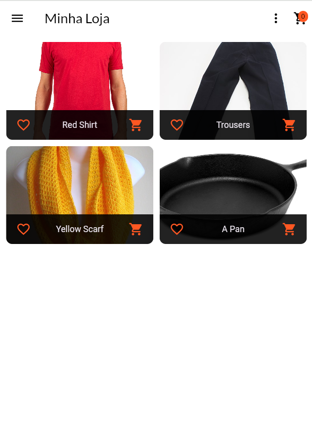
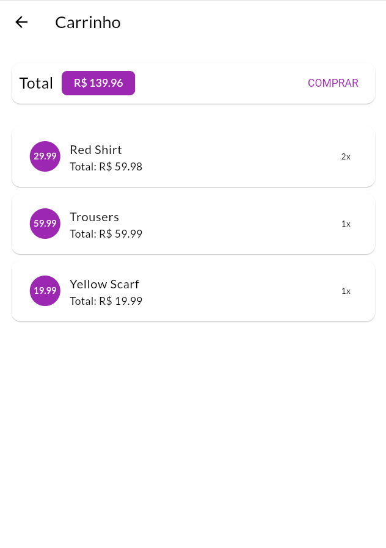
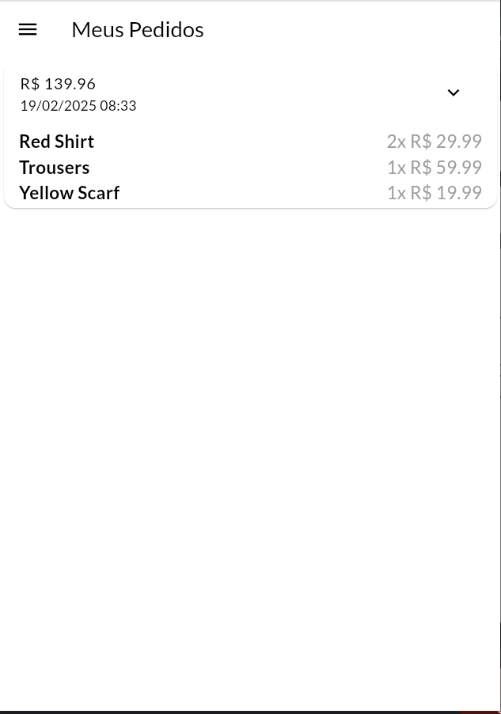
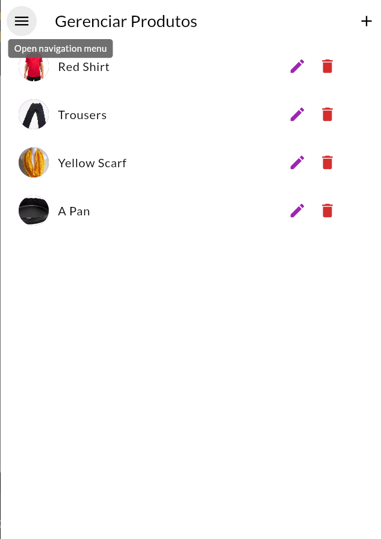

# Shop-App
Aplicativo de gerenciamento e compras em loja virtual, desenvolvido durante o curso de Flutter da COD3R.

*Aplicação não possui banco de dados / serviços em nuvem integrados

## Funcionalidades
A aplicação contém tanto funcionalidades de loja, como carrinho de compras, pedidos e navegação por itens, bem como ferramentas de gerenciamento. As funcionalidades estão detalhadamente descritas abaixo.

- Navegar por produtos: o usuário pode navegar pelos produtos cadastrados, visualizando em detalhes preço, descrição e outras informações.
- Favoritar produto: o usuário pode marcar como favorito produtos, e filtrar somente estes dentre todos os produtos da loja.
- Adicionar / excluir produtos de carrinho: o usuário pode adicionar produtos ao carrinho de compras, bem como excluí-los, caso não deseje mais adquirir esse produto.
- Fazer pedido: O usuário pode fazer um pedido dos itens que estão no carrinho, este que é adicionado a tela específica de pedidos.
- CRUD de produto: na tela de gerenciamento, o usuário pode manipular as informações relevantes ao produto, adicionando novos produtos ou editando / excluindo os produtos existentes. 

## Capturas de Tela

Abaixo estão algumas capturas de tela da aplicação:

### Tela inicial da loja

### Tela do carrinho (com produtos adicionados)

### Tela de pedidos

### Tela de gerenciamento de produtos

